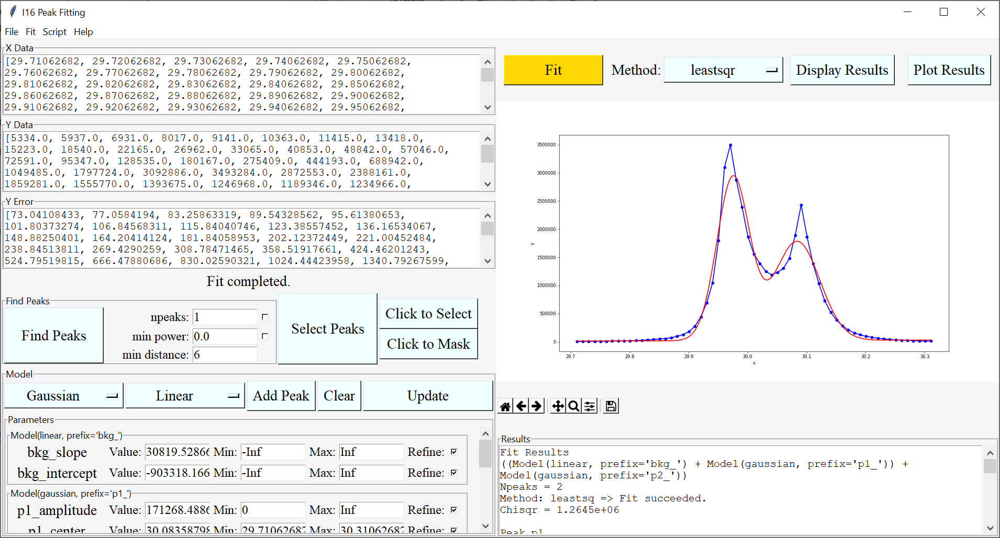

# i16_peakfit
Wrapper and graphical user inteface of lmfit for scattering experiments such as those on Diamond-I16

### Usage
Start GUI session:
``` bash
  $ python -m i16_peakfit
 ```
OR - Start GUI with data loaded
``` bash
  $ python -m bablescan /some/xye/file.dat
```



By Dan Porter, Diamond Light Source Ltd. 2021


